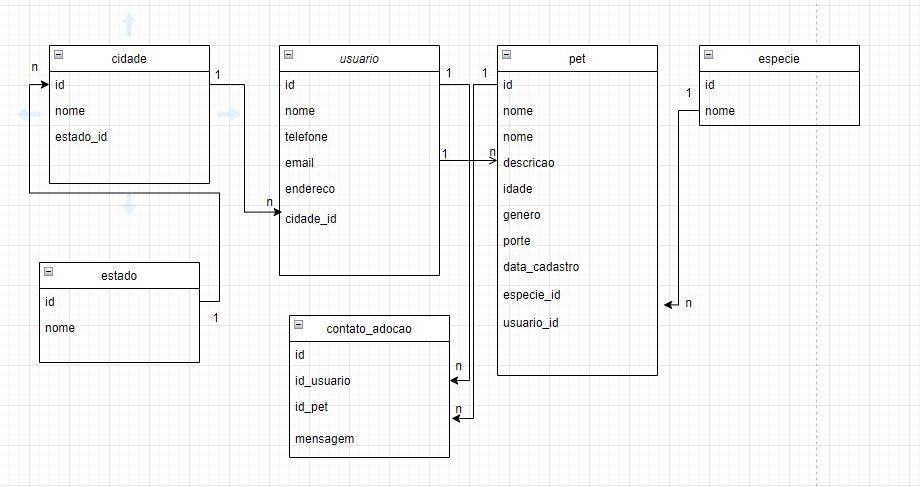

# Introdução

AdoPet é um portal para divulgação e controle de adoção de Pets.

O portal deve contar com um Front-end onde o usuário vai realizar as iterações e um back-end responsável pelas APIs. O Front-end deve ser desenvolvido utilizando ReactJS e o Back-end deve utilizar o framework NestJS.
A aplicação front-end deve consumir os recursos do back-end para consultar e persistir os dados da aplicação.

# Premissas: 
1. Será possível que um usuário cadastrado possa cadastrar Pets para adoção.
    Campos obrigatórios que vão ser definidos devem ser preenchidos no cadastro de um pet para adoção. Nome do pet, a espécie, o sexo, a cidade, alguma descrição, pelo menos uma foto e um contato.

2. Usuário sem cadastro deve poder consultar os Pets cadastrados para adoção
3. Qualquer pessoa vai poder se cadastrar em uma fila de espera para adoção informando alguns dados obrigatórios. 
    Caracteristicas do pet que está procurando. 
4. Ao ser cadastrado um pet para adoção uma busca na fila de adoção deve ser realizaza automaticamente e em caso de compatibilidade, o usuário na fila de adoção deve ser notificado.

# Entidades

`Pet`
id: number
name: string
age: number
genre: enum 
type: enum
size: enum
details: string
imageUrl: string
status: enum

`user`
id: number
name: string
email: string
phone: string
address: string

# Endpoints

## Pet

- `listAvailablePets` -> Retornar uma lista com todos os Pets disponíveis do sistema. Esse Endpoint deve receber um filtro para retornar apenas pets com status available.
- `addPet` -> Receber as informações de um pet e persistir no banco de dados.
- `updatePet{id}` -> Atualizar as informações de um pet com base no ID informado.
- `getPet{id}` -> Retorna informações de um Pet com base no ID informado.

## User

- `listUsers` -> Listar todos os usuários cadastrados no sistema
- `findById{id}` -> Retorna informações do usuário com base no ID.
- `addUser` -> Cadastra usuário no sistema.  
- `updateUser` -> Atualiza dados do Usuário

